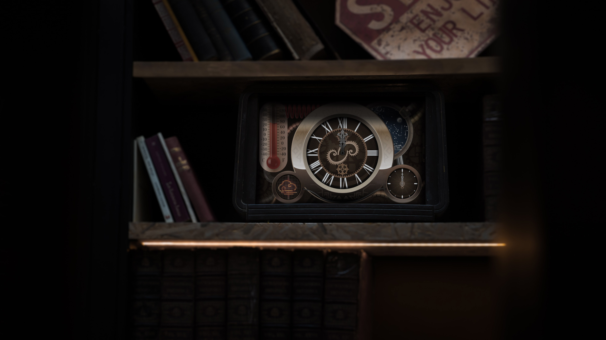

:globe_with_meridians:  [english](README.md)    <u>**český**</u>    [русский](README.ru.md)

# Steampunk hodinky pro soutěž Flutter Clock :mantelpiece_clock:

Tato aplikace byla vytvořena ve frameworku Flutter, pro společnou vývojářskou/design soutěž firem Google a Lenovo, pod názvem “***Flutter Clock***”. Cílem této soutěže bylo vytvoření nejhezčího designu chytrých hodinek Lenovo, za použiti frameworku Flutter, pomocného baličku Flutter Clock Helper a bezplatných/volných nástrojů. Více o soutěži, v anglickém jazyce naleznete na oficiálních stránkách: [flutter.dev/clock](https://flutter.dev/clock)

Vytvořil jsem variantu analogových hodinek, v duchu Viktoriánské éry (konec osmnáctého, začátek devatenáctého století). Je to spíše designérská soutěž — proto je tu **hodně detailů a animaci**, vytvořených pomoci nástroje [Rive](https://rive.app) (bývalé Flare).

> **Poznámka:** design je sám o sobě nezávislý na velikosti displeje, tj. aplikaci lze spustit na jakkoli velkém displeji bez ztráty kvality (všechna grafika je připravena ve křivkách), avšak vytvářel jsem ho pro menší displeje, o velikosti cca 4-6’ (tak je velký displej chytrých hodinek Lenovo).

Obsahují tmavé a světlé téma, **kukačku** a taky zobrazují počasí a teplotu, získané přes pomocný balíček Flutter Clock Helper. **Ukázku všech hlavních funkci a animaci naleznete v tomto videu:**

[Vimeo](https://vimeo.com/tsinis/futterclock) nebo [YouTube](http://www.youtube.com/watch?v=DQluq00k9hs)

[YouTube](http://www.youtube.com/watch?v=DQluq00k9hs)

---

* Samotný kód tohoto projektu (včetně mých komentářů) а další informace, se nacházejí ve složce [analog_clock](./analog_clock).
* Další informace o ručně zpracované vektorové grafice, použité pro animace [Rive](https://rive.app), naleznete ve složce [vector_assets](./vector_assets).

> V každé z těchto dvou složek jsou další video materiály o přípravě animací nebo o spuštění aplikace na reálných zařízeních.

* Kód pomocného baličku Flutter Clock Helper se nachází v *nedotčené** složce [flutter_clock_helper](./flutter_clock_helper) tohoto repositáře GitHub.

[* *pouze jsem přesunul soubor LICENCE Googlu, protože je to jejich kód*](./flutter_clock_helper/LICENSE)
