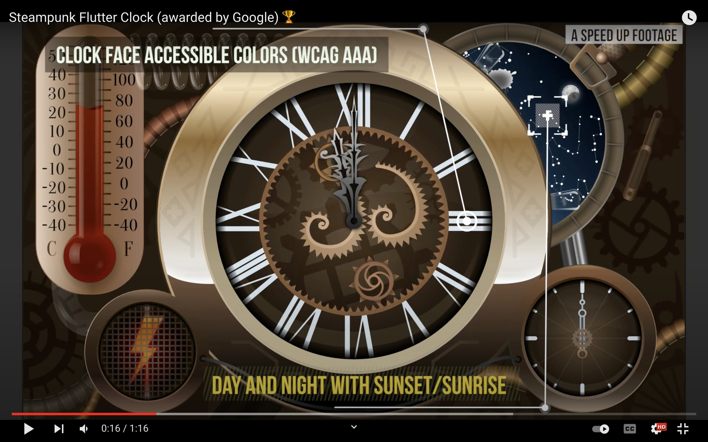

:globe_with_meridians:  **<u>english</u>**	[český](README.cz.md)	[русский](README.ru.md)

# Steampunk Clock for Flutter Clock contest :mantelpiece_clock

This project is **one of the winning submissions** in **Google's & Lenovo** dev/design contest, called "***Flutter Clock***" (with **over 850** valid entries from around the world). You can read more about this contest here: [flutter.dev/clock](https://flutter.dev/clock)

I've made a analog clock variant, with look and feel of, late 18 or early 19 century. This is mainly design contest, so, there is **a lot of details and animations inside**, made with [Rive](https://rive.app) (ex Flare) tool.
> **Note:** design is screen size independent, because all the graphics is made in vectors (not bitmaps), but I have prepared it with 4-6' screen size in mind (so as big as Lenovo's Smart Clock display).

It has a light theme and a dark theme, **cuckoo bird, four easter eggs** and displays sample weather and temperature data, provided from Flutter Clock Helper package. App works on all platforms that Flutter offers and fully covered with tests. You can watch a **preview video of it (with main functionality highlight) here:**

[Vimeo](https://vimeo.com/tsinis/flutterclock) or [YouTube](https://youtu.be/1cwBYMQwRb8)

---

* For more information, see the inside [analog_clock](./analog_clock/).
* For more info about handmade vector assets, used in [Rive](https://rive.app) animations, please, take a look at [vector_assets](./vector_assets) folder.

> In each of these two folders, there are additional videos of the animations preparation or the actual app launch on real devices.

* For Flutter Clock Helper code, see inside *untouched** [flutter_clock_helper](./flutter_clock_helper) folder, in this GitHub repo.

[* *only updated the code to null-safety and moved Google's LICENSE file there, since that is their code.*](./flutter_clock_helper/LICENSE)
