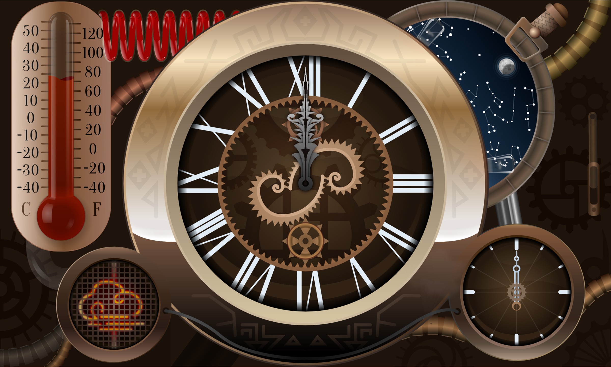

:globe_with_meridians:  [english](README.md)    <u>**český**</u>    [русский](README.ru.md)

# Kód projektu steampunkových hodinek Flutter Clock

## Obsah

* [Popis](#Popis)
* [Licence](#Licence)
* [Záběry ze skutečných zařízení](#Záběry-ze-skutečných-zařízení)
* [Změny](#Změny)
* [Vydání](#Vydání)
* [Testy](#Testy)



## Popis

Tady naleznete kód tohoto projektu Steampankových hodinek pro soutěž Flutter Clock, Kód se řidí pravidly soutěže, které jsou k dispozici na webu, v anglickém jazyce: [flutter.dev/clock](https://flutter.dev/clock).

## Licence

Kód je licencován na základě příslušné licence s otevřeným zdrojovým kódem (licence BSD tzv. Kalifornské univerzity v Berkeley), podklady ve složce [assets](./assets) jsou licencována s licencí CC BY 4.0 a písmo ve složce [third_party](./third_party), obsahuje licenci OFL. Soubor s názvem LICENSE najdete uvnitř adresářů, který obsahuje kopii licence, s plným textem této licence, v anglickém jazyce.

## Záběry ze skutečných zařízení

Zde najdete nedotčené, 4K záběry, ze skutečných zařízení, s operačními systémy iOS (iPhone, z roku 2016) a Android (tablet 2 v 1, z roku 2013), na nichž jsou vidět tyto hodiny.

Kontrolní součty:

MD5: ```85112361007BD86664C871030E1D3D55```

SHA-1: ```0CFCDFE7EA241C304CA694CC376983F11B1C6E6D```

[](https://1drv.ms/u/s!Aoc8-1_hYIfGiFPEwgpoCKerXyNC?e=TLMM3v)

[Dropbox](https://www.dropbox.com/sh/artyk72v9tckws3/AAAc5q7e0c70HiCDLuuiNN9Ia?dl=0) |
[Google Drive](https://drive.google.com/open?id=1XkKovGk6c6a0NpMadtCMXMx6KAM61RPp) | [Mega.nz](https://mega.nz/#F!5UlUzKBT!NZLFHkueFZT_SJWvZf1yAQ) |
[OneDrive](https://1drv.ms/u/s!Aoc8-1_hYIfGiFPEwgpoCKerXyNC?e=TLMM3v) |
[Amazon Drive](https://www.amazon.com/clouddrive/share/gtEpUwtoJYL0UvYkvPirVcsCnrloKuaGbtxKqbrCWlr) |
[iCloud](https://www.icloud.com/iclouddrive/0BYofNXgp-nZoBJBiTW_gIJlg#20200121%5F143234)

## Změny

Hlavní změny oproti původnímu kódu, z příkladu analogových hodinek, poskynutého firmou Google:

* odstraněný nevyužité soubory a složky,
* v tomto [kořenovém](./) adresáři:
  * úpraven [.gitignore](./.gitignore) soubor,
  * přidány linty do souboru [analysis_options.yaml](./analysis_options.yaml),
  * přidány runnery pro všechny platformy,
  * testy byly přidány do složky [test](./test) a jejich pokrytí do složky [coverage](./coverage),
  * přidány [README.md](./README.md) soubory v různých jazycích,
  * do [pubspec.yaml](./pubspec.yaml) přidány — závislost [Rive](https://rive.app) (bývalé Flare), testovací a lint závislosti, upraven popis a verze SDK byla zvýšena na 2.16.0,
* v [lib](./lib) adresáři:
  * [main.dart](./lib/main.dart) — přidán celoobrazovkový řežím a orientace na šířku, ukládaní animaci do mezipaměti, zbytek beze změn,
  * [analog_clock.dart](./lib/analog_clock.dart) — odstraněné nevyužité proměnné, deklarován ovladač animaci a změnený dvě metody, zbytek beze změn,
  * přidány soubory [time_animation_controller.dart](./lib/time_animation_controller.dart) a [temperature_converter.dart](./lib/temperature_converter.dart),
* složka [assets](./assets) — nevyužita grafika vyměněna za soubor animace,
* složka [ios](./ios) — nastavená orientace na šířku pro iOS zařízeni, vygenerován unikátní název,
* složka [android](./android) — upraven [build.gradle](./android/build.gradle) soubor (viz Známé problémy),
* přidána složka [third_party](./third_party), obsahující písmo a licenci k němu.

**Veškerý nový/úpravný kód obsahuje komentáře**, popisující co se děje.

## Vydání

Binární spouštěcí soubory najdete v části [Releases](https://github.com/tsinis/flutter_clock/releases) tohoto repozitáře GitHub.

## Testy

Aplikace je na 100% pokryta unit/widget testy (report je [./coverage](./coverage/html/)) nebo generujte pomocí*:

```bash
flutter test --coverage
genhtml coverage/lcov.info -o coverage/html'
```

> vyžaduje nainstalovaný lcov*
